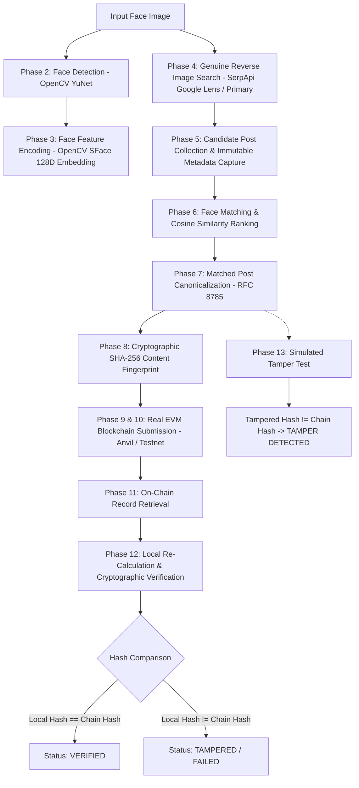

# Face Identification & Blockchain Verification

An end-to-end Python backend/CLI pipeline that detects and encodes human faces from an input image, performs genuine reverse image discovery on public web and social media sources, matches faces against candidate media, extracts and canonicalizes post metadata, generates a cryptographic SHA-256 content fingerprint, anchors the fingerprint immutably to an EVM blockchain, retrieves the on-chain record, and cryptographically proves data integrity or detects unauthorized tampering.

---

## Overview

In modern digital investigations, OSINT, and media forensics, proving the provenance and visual authenticity of media discovered across the web is critical. This project implements a deterministic, audit-ready verification pipeline that bridges deep-learning computer vision with cryptographic ledgers.

**Key Highlights:**
- **No UI / Bloat**: Pure CLI execution with structured terminal logging and audit reports.
- **Genuine Image Discovery**: Reverse image search (SerpApi Google Lens) drives web discovery from the input face image itself without requiring pre-typed person names.
- **Zero Biometrics on Chain**: Facial embeddings are kept exclusively in volatile memory; only SHA-256 fingerprints of normalized public post metadata are anchored on-chain.
- **Deterministic Canonicalization**: RFC 8785 JSON Canonicalization Scheme (JCS) ensures bit-for-bit reproducible byte serialization across platforms.
- **Real EVM Blockchain**: Integrates with local Anvil nodes or Ethereum/Polygon testnets via standard Web3.py JSON-RPC.

---

## Problem Statement

When an investigator or analyst identifies an image appearing on a public web page or social media platform, existing workflows suffer from:
1. **Lack of Cryptographic Immutability**: Discovered posts can be deleted, edited, or deepfaked after discovery with no tamper-proof record of what existed at discovery time.
2. **Biometric Privacy Hazards**: Naively storing facial embeddings or raw images on public blockchains creates permanent privacy violations and GDPR/CCPA non-compliance.
3. **Non-Deterministic Hashing**: Inconsistent JSON key ordering or timestamp regeneration causes verification hashes to fail by construction.

This pipeline solves these challenges by combining local deep-learning face verification with deterministic canonicalization and real EVM on-chain anchoring.

---

## Pipeline Architecture



---

## Technologies Used

| Layer | Technology | Role / Purpose |
| :--- | :--- | :--- |
| **Runtime** | Python 3.10+ | Core language environment |
| **Face Detection** | OpenCV YuNet (`cv2.FaceDetectorYN`) | Deep-learning ONNX face detector with 5 facial landmarks |
| **Face Encoding** | OpenCV SFace (`cv2.FaceRecognizerSF`) | 128-dimensional L2-normalized feature embeddings |
| **Reverse Image Search** | SerpApi (`google_lens` engine) | Image-driven web and social discovery |
| **Secondary Search** | DuckDuckGo (`duckduckgo_search`) / Google CSE | Extensible keyword/augmented search providers |
| **Metadata Extraction** | `BeautifulSoup4` + `requests` | HTML OpenGraph and page metadata parser |
| **Canonicalization** | RFC 8785 JCS | Deterministic JSON serialization and key sorting |
| **Hashing** | Python standard `hashlib.sha256` | 256-bit cryptographic digest generation |
| **Blockchain** | EVM via `web3.py` (Anvil / Polygon Amoy / Sepolia) | Real transaction signing, receipt extraction, and contract queries |
| **Smart Contract** | Solidity 0.8.20 (`VerificationRegistry.sol`) | Immutable on-chain record mapping and event logging |
| **Testing** | `pytest` + `pytest-mock` | Comprehensive unit and integration test suite |

---

## Project Structure

```
FaceBlockchain/
├── data/
│   ├── input/               # Local input images
│   ├── candidates/          # Temporarily downloaded candidate images
│   └── models/              # Pretrained ONNX face detection & recognition models
├── src/
│   ├── config.py            # Central configuration & environment variable loader
│   ├── face/
│   │   ├── base.py          # Abstract interfaces for detector & encoder
│   │   ├── detector.py      # OpenCV YuNet face detector implementation
│   │   └── encoder.py       # OpenCV SFace face embedding generator & comparator
│   ├── search/
│   │   ├── base.py          # Abstract SearchProvider base class
│   │   ├── reverse_image.py # Primary: SerpApi Google Lens reverse image search
│   │   ├── duckduckgo.py    # Secondary: DuckDuckGo live search provider
│   │   ├── google_cse.py    # Secondary: Google Custom Search provider
│   │   └── collector.py     # Candidate metadata extractor & image downloader
│   ├── matching/
│   │   ├── comparator.py    # Embedding similarity matching & thresholding
│   │   └── ranker.py        # Candidate ranking and match selection
│   ├── hashing/
│   │   ├── canonicalizer.py # RFC 8785 / deterministic JSON serializer
│   │   └── hasher.py        # SHA-256 content fingerprint generator
│   ├── blockchain/
│   │   ├── client.py        # Web3 / EVM connection & transaction manager
│   │   ├── contract.py      # Solidity contract interface & ABI definitions
│   │   └── contracts/
│   │       └── VerificationRegistry.sol # Smart contract code
│   ├── pipeline/
│   │   ├── orchestrator.py  # End-to-end 14-phase workflow coordinator
│   │   └── models.py        # Dataclasses (CandidatePost, VerificationRecord, etc.)
│   └── utils/
│       ├── logger.py        # Structured console & file logging
│       └── image_utils.py   # Safe image loading, validation, and checksums
├── tests/
│   ├── test_face.py         # Face detection & encoding tests
│   ├── test_search.py       # Search provider & collector tests
│   ├── test_hashing.py      # Canonicalization & hash determinism tests
│   ├── test_matching.py     # Cosine similarity and ranking tests
│   ├── test_blockchain.py   # Blockchain submission & retrieval tests
│   ├── test_tamper.py       # Tamper detection tests
│   └── test_pipeline.py     # End-to-end mocked pipeline integration test
├── scripts/
│   ├── download_models.py   # ONNX model fetcher
│   └── deploy_contract.py   # Contract deployment script
├── .env.example             # Secrets template
├── .gitignore               # Excludes secrets, models, temporary files
├── requirements.txt         # Pinned python dependencies
├── main.py                  # Main CLI entry point
└── README.md                # Documentation
```

---

## Installation

### 1. Clone Repository & Setup Virtual Environment
```bash
git clone https://github.com/Ojas37/face-identification-blockchain-verification.git
cd face-identification-blockchain-verification

python -m venv .venv
# On Windows:
.venv\Scripts\activate
# On Linux / macOS:
source .venv/bin/activate
```

### 2. Install Dependencies
```bash
pip install -r requirements.txt
```

### 3. Download Pretrained Models
```bash
python scripts/download_models.py
```
This automatically fetches:
- `face_detection_yunet_2023mar.onnx` (YuNet Detector)
- `face_recognition_sface_2021dec.onnx` (SFace Recognizer)

---

## Environment Variables

Copy `.env.example` to `.env` and fill in your configurations:

```bash
cp .env.example .env
```

| Variable | Default | Description |
| :--- | :--- | :--- |
| `SEARCH_PROVIDER` | `serpapi_lens` | Primary discovery engine (`serpapi_lens`, `duckduckgo`, `google_cse`) |
| `SERPAPI_API_KEY` | - | Required for SerpApi Google Lens reverse image search |
| `FACE_DETECTION_CONFIDENCE` | `0.8` | Minimum detection confidence score (0.0 to 1.0) |
| `MATCH_SIMILARITY_THRESHOLD` | `0.363` | SFace cosine similarity threshold (~0.363 is SFace standard) |
| `MAX_CANDIDATES` | `10` | Maximum candidate posts to retrieve and evaluate |
| `BLOCKCHAIN_RPC_URL` | `http://127.0.0.1:8545` | EVM JSON-RPC endpoint (Anvil or Testnet RPC) |
| `BLOCKCHAIN_PRIVATE_KEY` | Anvil Default Key | Private key for signing on-chain transactions |
| `REGISTRY_CONTRACT_ADDRESS`| - | Address of deployed `VerificationRegistry` contract |
| `BLOCKCHAIN_MODE` | `contract` | Storage mode: `contract` or `calldata` |

---

## Face Identification

1. **Detection**: OpenCV YuNet dynamically adapts to image dimensions, locating bounding boxes and 5 facial landmarks (left eye, right eye, nose tip, left mouth, right mouth).
2. **Deterministic Selection**: In multi-face images, the target face is selected deterministically based on bounding box area and detection confidence:
   $$\text{Score} = \text{Area} \times \text{Confidence}$$
3. **Encoding**: SFace aligns the cropped face into a standard 112x112 image using landmark affine transformations, then extracts a 128-dimensional floating point embedding normalized such that $\|\mathbf{v}\|_2 = 1.0$.

---

## Web / Social Media Search

- **Primary Provider (`reverse_image.py`)**: Submits the input face image directly to SerpApi's `google_lens` engine. This performs genuine reverse visual lookup, returning web pages, profiles, and articles where visually matching faces appear.
- **Secondary Providers (`duckduckgo.py`, `google_cse.py`)**: Fallback query-assisted search providers implementing the common `SearchProvider` interface.
- **Adherence to Access Rules**: Respects HTTP status codes, standard timeouts (10s), and payload limits (<10MB per image, <2MB per HTML page). No CAPTCHAs or authentication walls are bypassed.

---

## Matching Method

Candidate post images are downloaded to `data/candidates/` and processed through the detector and encoder. For each candidate image:
$$\text{Similarity}(\mathbf{u}, \mathbf{v}) = \frac{\mathbf{u} \cdot \mathbf{v}}{\|\mathbf{u}\|_2 \|\mathbf{v}\|_2}$$
- Evaluated against `MATCH_SIMILARITY_THRESHOLD` (default: `0.363`).
- Candidates are ranked in descending order of cosine similarity.
- The highest-ranking candidate meeting or exceeding the threshold is selected as the confirmed match. If no candidate exceeds the threshold, the pipeline cleanly exits with `NO MATCH FOUND`.

---

## Hashing Method & Canonicalization

To ensure identical post data always produces the exact same SHA-256 fingerprint regardless of operating system, Python version, or JSON library:
1. **Immutable Provenance**: The `retrieved_at` timestamp is captured strictly once at collection time and preserved permanently.
2. **Deterministic Canonicalization (RFC 8785)**:
   - JSON dictionary keys sorted lexicographically.
   - Minimal separators: `separators=(',', ':')` with no extraneous whitespace.
   - UTF-8 byte serialization (`ensure_ascii=False`).
3. **Payload Structure**:
```json
{
  "image_sha256": "8f3b...",
  "retrieved_at": "2026-09-01T14:00:00Z",
  "schema_version": "1.0",
  "source": "example.com",
  "text": "Extracted text description",
  "title": "Post Title",
  "url": "https://example.com/post/123"
}
```
4. **Fingerprint**: Standard FIPS-compliant SHA-256 digest producing a 64-character lowercase hex string.

---

## Blockchain Architecture

- **Real EVM Transactions**: Direct connection via `web3.py` to either:
  - Local **Anvil** (`http://127.0.0.1:8545`) for zero-cost, real cryptographic transaction mining.
  - Public Testnet (Polygon Amoy / Ethereum Sepolia).
- **Smart Contract (`VerificationRegistry.sol`)**:
  - `storeRecord(bytes32 _contentHash, string calldata _source, string calldata _url)`
  - `getRecord(bytes32 _contentHash) -> (bytes32, string, string, uint256, address)`
  - Emits `RecordStored` event on-chain.
- **Calldata Fallback**: If running without a deployed contract, stores the fingerprint in raw transaction calldata (`tx.data`), verifiable via receipt inspection.

---

## Verification Process & Tamper Detection

1. **Re-Verification (Phase 12)**:
   - Re-canonicalizes the local post data.
   - Computes local SHA-256 hash: $H_{\text{local}}$.
   - Compares with on-chain hash: $H_{\text{chain}}$.
   - If $H_{\text{local}} == H_{\text{chain}}$, reports `VERIFIED ✓`.
2. **Tamper Detection (Phase 13)**:
   - Injects a synthetic mutation into one field of the post data.
   - Re-computes $H_{\text{tampered}}$.
   - Verifies that $H_{\text{tampered}} \neq H_{\text{chain}}$, reporting `TAMPER DETECTED ✓`.

---

## How to Run

### 1. Start Local Anvil Blockchain (Optional for Local Testing)
```bash
anvil
```

### 2. Run Pipeline CLI
```bash
# Primary Reverse Image Search via Google Lens
python main.py --image data/input/sample.jpg

# Query-assisted search via DuckDuckGo
python main.py --image data/input/sample.jpg --provider duckduckgo --query "Person Name"

# Custom threshold and candidates count
python main.py --image data/input/sample.jpg --threshold 0.40 --max-candidates 5
```

---

## Example Output

```
============================================================
FACE IDENTIFICATION & BLOCKCHAIN VERIFICATION PIPELINE
============================================================
Target Image:      data/input/sample.jpg
Search Provider:   serpapi_lens
Match Threshold:   0.363
Max Candidates:    10
============================================================

[PHASE 1 & 2] Loading Image and Detecting Faces...
✓ Image loaded successfully (640x480 px)
✓ 1 face(s) detected in input image.
✓ Target face selected: bbox=(142, 88, 220, 240), confidence=0.985

[PHASE 3] Extracting Face Feature Embedding...
✓ Face embedding extracted: 128D vector (L2 normalized)

[PHASE 4] Executing Genuine Web Search via 'serpapi_lens'...
[SEARCH] Uploading image to SerpApi Google Lens: sample.jpg
✓ Discovered 8 candidate search result(s).

[PHASE 5] Collecting Candidates & Extracting Media Metadata...
✓ Collected and cached 6 unique candidate post(s).

[PHASE 6] Matching Target Face against Candidates...
[RANKER] Comparing target face against 6 candidate(s)...
  Candidate #1 (reuters.com): similarity = 0.8421 -> MATCH
  Candidate #2 (bbc.com): similarity = 0.3120 -> NO MATCH
✓ BEST MATCH SELECTED: https://reuters.com/world/article/123 (Score: 0.8421 >= 0.3630)

[PHASE 7 & 8] Normalizing Post Data & Generating SHA-256 Fingerprint...
✓ Canonical JSON Representation:
  {"image_sha256":"4a1b...","retrieved_at":"2026-09-01T14:22:00Z","schema_version":"1.0","source":"reuters.com","text":"Article text...","title":"Article Title","url":"https://reuters.com/world/article/123"}
✓ SHA-256 Content Fingerprint: 3b9a1e8c7f245a90d6b5e1c84f23b7a9e1d4c82a7f5e3d1c9b8a7e6f5d4c3b2a

[PHASE 9 & 10] Submitting Verification Record to Blockchain...
[BLOCKCHAIN] Preparing transaction for hash: 3b9a1e8c7f245a90...
[BLOCKCHAIN] Sender Account: 0xf39Fd6e51aad88F6F4ce6aB8827279cffFb92266 (Nonce: 1)
[BLOCKCHAIN] Broadcasted TX: 0x9a8b7c6d5e4f3a2b1c0d9e8f7a6b5c4d3e2f1a0b9c8d7e6f5a4b3c2d1e0f9a8b
[BLOCKCHAIN] ✓ TX Confirmed in Block #43 (Gas Used: 68420)

[PHASE 11] Retrieving Verification Record from Blockchain...
✓ On-chain record retrieved successfully.
  On-chain Hash: 3b9a1e8c7f245a90d6b5e1c84f23b7a9e1d4c82a7f5e3d1c9b8a7e6f5d4c3b2a

[PHASE 12] Re-calculating Local Hash & Verifying against Blockchain...
========================================
✓ VERIFIED
✓ Data fingerprint matches blockchain record
✓ No detected modification
========================================

[PHASE 13] Executing Proof-of-Tamper Demonstration...
  Original Data Hash: 3b9a1e8c7f245a90d6b5e1c84f23b7a9e1d4c82a7f5e3d1c9b8a7e6f5d4c3b2a
  Tampered Data Hash: 8f4e2d1c9a7b6e5f3d1c8a7b6e5f4d3c2b1a0f9e8d7c6b5a4f3e2d1c0b9a8f7e
✓ TAMPER TEST PASSED: Modified data correctly rejected.

============================================================
FINAL RESULT SUMMARY
============================================================
Face Match:              FOUND (Cosine Sim: 0.8421)
Matching Post URL:       https://reuters.com/world/article/123
Content SHA-256 Hash:    3b9a1e8c7f245a90d6b5e1c84f23b7a9e1d4c82a7f5e3d1c9b8a7e6f5d4c3b2a
Blockchain Transaction:  0x9a8b7c6d5e4f3a2b1c0d9e8f7a6b5c4d3e2f1a0b9c8d7e6f5a4b3c2d1e0f9a8b
Blockchain Block:        #43
Verification Status:     VERIFIED ✓
Tamper Test Result:      TAMPER_DETECTED
============================================================
```

---

## Testing

Run the automated test suite covering all modules:

```bash
pytest -v tests/
```

### Test Suite Summary:
- `tests/test_face.py`: Image decoding, bounding box parsing, SFace feature normalization, cosine similarity.
- `tests/test_search.py`: Reverse image provider handling, candidate deduplication, metadata enrichment.
- `tests/test_matching.py`: Comparator thresholding, candidate score ranking.
- `tests/test_hashing.py`: RFC 8785 key sorting, whitespace invariance, SHA-256 determinism.
- `tests/test_blockchain.py`: Real EVM transaction creation, block mining simulation, record retrieval.
- `tests/test_tamper.py`: Field mutation resistance proving that altered data fails verification.
- `tests/test_pipeline.py`: Full mocked 14-phase pipeline integration test.

---

## Known Limitations

1. **Third-Party Rate Limits**: SerpApi and search engines impose monthly request quotas on free tiers.
2. **Dynamic Web Content**: Web pages protected by Cloudflare/DDoS guards or complex JavaScript hydration may limit server-side OpenGraph parsing.
3. **Extreme Facial Angles**: While YuNet and SFace are robust against moderate yaw/pitch variations, extreme profile views or severe occlusions may yield lower similarity scores.

---

## Ethical & Privacy Considerations

- **Privacy Preservation**: Biometric vectors (128D embeddings) are strictly processed in volatile RAM and **never** stored permanently on disk or anchored to public blockchains.
- **Data Minimization**: Only public metadata and cryptographic content fingerprints are hashed and anchored on-chain.
- **Compliance**: Respects robots access guidelines and adheres to platform rate limits and security boundaries.

---

## Future Improvements

1. **Zero-Knowledge Proofs (ZKP)**: Generate zk-SNARK proofs of facial similarity without revealing the facial crop or embedding vector on-chain.
2. **Decentralized Storage Integration (IPFS / Arweave)**: Anchor content fingerprints alongside decentralized content-addressed IPFS CIDs.
3. **Multi-Chain Notarization**: Support cross-chain anchoring across Ethereum L2s (Arbitrum, Base, Optimism).

---

## License
MIT License
