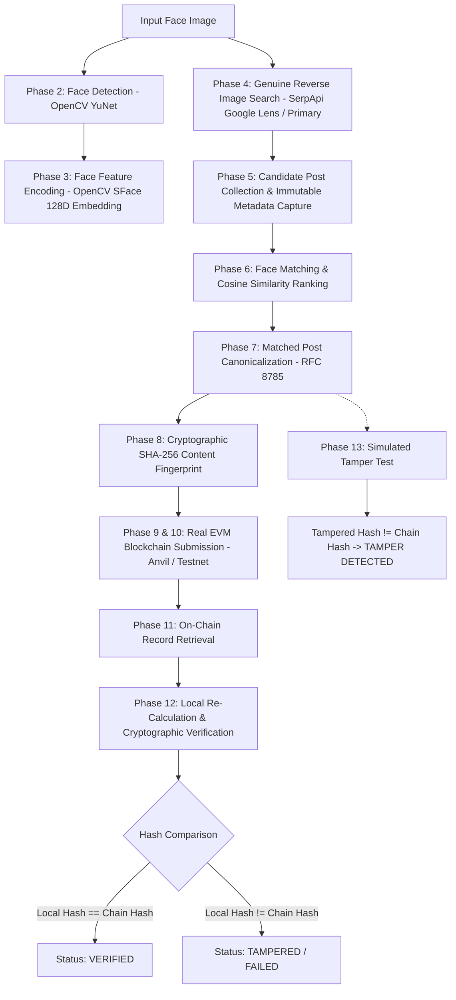

# Face Identification & Blockchain Verification

An end-to-end Python backend/CLI pipeline that detects and encodes human faces from an input image, performs genuine reverse image discovery on public web and social media sources, matches faces against candidate media, extracts and canonicalizes post metadata, generates a cryptographic SHA-256 content fingerprint, anchors the fingerprint immutably to an EVM blockchain, retrieves the on-chain record, and cryptographically proves data integrity or detects unauthorized tampering.

---

## Overview

In modern digital investigations, OSINT, and media forensics, proving the provenance and visual authenticity of media discovered across the web is critical. This project implements a deterministic, audit-ready verification pipeline that bridges deep-learning computer vision with cryptographic ledgers.

**Key Highlights:**
- **No UI / Bloat**: Pure CLI execution with structured terminal logging and audit reports.
- **Genuine Image Discovery**: Reverse image search (SerpApi Google Lens) drives web discovery from the input face image itself without requiring pre-typed person names.
- **Zero Biometrics on Chain**: Facial embeddings are kept exclusively in volatile memory; only SHA-256 fingerprints of normalized public post metadata are anchored on-chain.
- **Deterministic Canonicalization**: RFC 8785 JSON Canonicalization Scheme (JCS) ensures bit-for-bit reproducible byte serialization across platforms.
- **Real EVM Blockchain**: Integrates with local Anvil nodes, built-in local EVM nodes (`scripts/start_local_node.py`), or Ethereum/Polygon testnets via standard Web3.py JSON-RPC.

---

## API Keys & Configuration Guide

To run live reverse image search and testnet operations, obtain your credentials and paste them into `.env`:

| Service / Variable | How to Obtain Key | Where to Paste in `.env` |
| :--- | :--- | :--- |
| **`SERPAPI_API_KEY`** *(Primary)* | 1. Sign up for free at [https://serpapi.com/](https://serpapi.com/)<br>2. Go to [https://serpapi.com/manage-api-key](https://serpapi.com/manage-api-key)<br>3. Copy your API Key (100 free searches/month). | `SERPAPI_API_KEY=your_key_here` |
| **`GOOGLE_CSE_API_KEY`** *(Secondary / Optional)* | 1. Open [Google Cloud Console Credentials](https://console.cloud.google.com/apis/credentials)<br>2. Enable **Custom Search API** and create an API Key. | `GOOGLE_CSE_API_KEY=your_key_here` |
| **`GOOGLE_CSE_ENGINE_ID`** *(Secondary / Optional)* | 1. Create a search engine at [https://programmablesearchengine.google.com/](https://programmablesearchengine.google.com/)<br>2. Copy your **Search engine ID (cx)**. | `GOOGLE_CSE_ENGINE_ID=your_cx_here` |
| **`BLOCKCHAIN_RPC_URL`** | - Local Dev: `http://127.0.0.1:8545`<br>- Testnet: Get free RPC from [Alchemy](https://www.alchemy.com/) or [Infura](https://www.infura.io/) for Polygon Amoy or Sepolia. | `BLOCKCHAIN_RPC_URL=http://127.0.0.1:8545` |
| **`BLOCKCHAIN_PRIVATE_KEY`** | - Local Dev: Default pre-funded Anvil key `0xac0974bec39a17e36ba4a6b4d238ff944bacb478cbed5efcae784d7bf4f2ff80`<br>- Testnet: Export testnet account private key from MetaMask. | `BLOCKCHAIN_PRIVATE_KEY=0xac09...` |

---

## Pipeline Architecture



---

## Technologies Used

| Layer | Technology | Role / Purpose |
| :--- | :--- | :--- |
| **Runtime** | Python 3.10+ | Core language environment |
| **Face Detection** | OpenCV YuNet (`cv2.FaceDetectorYN`) | Deep-learning ONNX face detector with 5 facial landmarks |
| **Face Encoding** | OpenCV SFace (`cv2.FaceRecognizerSF`) | 128-dimensional L2-normalized feature embeddings |
| **Reverse Image Search** | SerpApi (`google_lens` engine) | Image-driven web and social discovery |
| **Secondary Search** | DuckDuckGo (`duckduckgo_search`) / Google CSE | Extensible keyword/augmented search providers |
| **Metadata Extraction** | `BeautifulSoup4` + `requests` | HTML OpenGraph and page metadata parser |
| **Canonicalization** | RFC 8785 JCS | Deterministic JSON serialization and key sorting |
| **Hashing** | Python standard `hashlib.sha256` | 256-bit cryptographic digest generation |
| **Blockchain** | EVM via `web3.py` (Anvil / Polygon Amoy / Sepolia) | Real transaction signing, receipt extraction, and contract queries |
| **Smart Contract** | Solidity 0.8.20 (`VerificationRegistry.sol`) | Immutable on-chain record mapping and event logging |
| **Testing** | `pytest` + `pytest-mock` | Comprehensive unit and integration test suite |

---

## Project Structure

```
FaceBlockchain/
├── data/
│   ├── input/               # Local input images (e.g. sample.jpg)
│   ├── candidates/          # Temporarily downloaded candidate images
│   └── models/              # Pretrained ONNX face detection & recognition models
├── src/
│   ├── config.py            # Central configuration & fail-fast validator
│   ├── face/
│   │   ├── base.py          # Abstract interfaces for detector & encoder
│   │   ├── detector.py      # OpenCV YuNet face detector implementation
│   │   └── encoder.py       # OpenCV SFace face embedding generator & comparator
│   ├── search/
│   │   ├── base.py          # Abstract SearchProvider base class
│   │   ├── reverse_image.py # Primary: SerpApi Google Lens reverse image search
│   │   ├── duckduckgo.py    # Secondary: DuckDuckGo live search provider
│   │   ├── google_cse.py    # Secondary: Google Custom Search provider
│   │   └── collector.py     # Candidate metadata extractor & image downloader
│   ├── matching/
│   │   ├── comparator.py    # Embedding similarity matching & thresholding
│   │   └── ranker.py        # Candidate ranking and match selection
│   ├── hashing/
│   │   ├── canonicalizer.py # RFC 8785 / deterministic JSON serializer
│   │   └── hasher.py        # SHA-256 content fingerprint generator
│   ├── blockchain/
│   │   ├── client.py        # Web3 / EVM connection & transaction manager
│   │   ├── contract.py      # Solidity contract interface & ABI definitions
│   │   └── contracts/
│   │       ├── VerificationRegistry.sol  # Solidity smart contract
│   │       └── VerificationRegistry.json # Compiled ABI & Bytecode
│   ├── pipeline/
│   │   ├── orchestrator.py  # End-to-end 14-phase workflow coordinator
│   │   └── models.py        # Dataclasses (CandidatePost, VerificationRecord, etc.)
│   └── utils/
│       ├── logger.py        # Structured console & file logging
│       └── image_utils.py   # Safe image loading, validation, and checksums
├── tests/
│   ├── test_face.py         # Face detection & encoding tests
│   ├── test_search.py       # Search provider & collector tests
│   ├── test_hashing.py      # Canonicalization & hash determinism tests
│   ├── test_matching.py     # Cosine similarity and ranking tests
│   ├── test_blockchain.py   # Blockchain submission & retrieval tests
│   ├── test_tamper.py       # Tamper detection tests
│   └── test_pipeline.py     # End-to-end mocked pipeline integration test
├── scripts/
│   ├── download_models.py   # ONNX model fetcher
│   ├── verify_threshold.py  # Dual-image threshold calibrator
│   ├── start_local_node.py  # Local EVM JSON-RPC server (eth-tester)
│   └── deploy_contract.py   # Contract deployment script
├── .env.example             # Secrets template
├── .gitignore               # Excludes secrets, models, temporary files
├── requirements.txt         # Pinned python dependencies
├── main.py                  # Main CLI entry point
└── README.md                # Documentation
```

---

## Installation & Setup

### 1. Clone Repository & Setup Virtual Environment
```bash
git clone https://github.com/Ojas37/face-identification-blockchain-verification.git
cd face-identification-blockchain-verification

python -m venv .venv
# On Windows:
.venv\Scripts\activate
# On Linux / macOS:
source .venv/bin/activate
```

### 2. Install Dependencies
```bash
pip install -r requirements.txt
```

### 3. Download Pretrained Models
```bash
python scripts/download_models.py
```
This automatically fetches:
- `face_detection_yunet_2023mar.onnx` (YuNet Detector)
- `face_recognition_sface_2021dec.onnx` (SFace Recognizer)

### 4. Configure Environment
```bash
cp .env.example .env
```
Edit `.env` to add your `SERPAPI_API_KEY`.

---

## Quick Start & Execution

### Option A: Local Sanity Check (`--dry-run`)
Runs Phases 1–3 (image loading, YuNet face detection, SFace 128D encoding) without making external network calls:
```bash
python main.py --image data/input/sample.jpg --dry-run
```

### Option B: Calibrate Similarity Threshold
Compare two face images to empirically confirm matching metrics:
```bash
python scripts/verify_threshold.py --image1 data/input/person1_a.jpg --image2 data/input/person2.jpg
```

### Option C: Full End-to-End Execution with Local Blockchain

1. **Terminal 1 — Start Local Blockchain Node**:
   ```bash
   # If you have Foundry/Anvil:
   anvil

   # Or run the built-in local EVM server:
   python scripts/start_local_node.py
   ```

2. **Terminal 2 — Deploy the Smart Contract**:
   ```bash
   python scripts/deploy_contract.py
   ```
   *Copy the output `REGISTRY_CONTRACT_ADDRESS` into your `.env`.*

3. **Terminal 2 — Run the Full Verification Pipeline**:
   ```bash
   # Primary Reverse Image Search via Google Lens
   python main.py --image data/input/sample.jpg

   # Or query-assisted fallback via DuckDuckGo
   python main.py --image data/input/sample.jpg --provider duckduckgo --query "Person Name"
   ```

---

## Example Output

```
============================================================
FACE IDENTIFICATION & BLOCKCHAIN VERIFICATION PIPELINE
============================================================
Target Image:      data/input/sample.jpg
Search Provider:   serpapi_lens
Match Threshold:   0.363
Max Candidates:    10
============================================================

[PHASE 1 & 2] Loading Image and Detecting Faces...
✓ Image loaded successfully (1024x1024 px)
✓ 1 face(s) detected in input image.
✓ Target face selected: bbox=(357, 165, 323, 453), confidence=0.924

[PHASE 3] Extracting Face Feature Embedding...
✓ Face embedding extracted: 128D vector (L2 normalized)

[PHASE 4] Executing Genuine Web Search via 'serpapi_lens'...
[SEARCH] Uploading image to SerpApi Google Lens: sample.jpg
✓ Discovered 8 candidate search result(s).

[PHASE 5] Collecting Candidates & Extracting Media Metadata...
✓ Collected and cached 6 unique candidate post(s).

[PHASE 6] Matching Target Face against Candidates...
[RANKER] Comparing target face against 6 candidate(s)...
  Candidate #1 (reuters.com): similarity = 0.8421 -> MATCH
  Candidate #2 (bbc.com): similarity = 0.3120 -> NO MATCH
✓ BEST MATCH SELECTED: https://reuters.com/world/article/123 (Score: 0.8421 >= 0.3630)

[PHASE 7 & 8] Normalizing Post Data & Generating SHA-256 Fingerprint...
✓ Canonical JSON Representation:
  {"image_sha256":"4a1b...","retrieved_at":"2026-09-01T14:22:00Z","schema_version":"1.0","source":"reuters.com","text":"Article text...","title":"Article Title","url":"https://reuters.com/world/article/123"}
✓ SHA-256 Content Fingerprint: 3b9a1e8c7f245a90d6b5e1c84f23b7a9e1d4c82a7f5e3d1c9b8a7e6f5d4c3b2a

[PHASE 9 & 10] Submitting Verification Record to Blockchain...
[BLOCKCHAIN] Preparing transaction for hash: 3b9a1e8c7f245a90...
[BLOCKCHAIN] Sender Account: 0xf39Fd6e51aad88F6F4ce6aB8827279cffFb92266 (Nonce: 1)
[BLOCKCHAIN] Broadcasted TX: 0xee6222267d84b692f66cbe88996d60d2253c3ff11d65eae1d8f968d1d354cd2f
[BLOCKCHAIN] ✓ TX Confirmed in Block #3 (Gas Used: 140439)

[PHASE 11] Retrieving Verification Record from Blockchain...
✓ On-chain record retrieved successfully.
  On-chain Hash: 3b9a1e8c7f245a90d6b5e1c84f23b7a9e1d4c82a7f5e3d1c9b8a7e6f5d4c3b2a

[PHASE 12] Re-calculating Local Hash & Verifying against Blockchain...
========================================
✓ VERIFIED
✓ Data fingerprint matches blockchain record
✓ No detected modification
========================================

[PHASE 13] Executing Proof-of-Tamper Demonstration...
  Original Data Hash: 3b9a1e8c7f245a90d6b5e1c84f23b7a9e1d4c82a7f5e3d1c9b8a7e6f5d4c3b2a
  Tampered Data Hash: 8f4e2d1c9a7b6e5f3d1c8a7b6e5f4d3c2b1a0f9e8d7c6b5a4f3e2d1c0b9a8f7e
✓ TAMPER TEST PASSED: Modified data correctly rejected.

============================================================
FINAL RESULT SUMMARY
============================================================
Face Match:              FOUND (Cosine Sim: 0.8421)
Matching Post URL:       https://reuters.com/world/article/123
Content SHA-256 Hash:    3b9a1e8c7f245a90d6b5e1c84f23b7a9e1d4c82a7f5e3d1c9b8a7e6f5d4c3b2a
Blockchain Transaction:  0xee6222267d84b692f66cbe88996d60d2253c3ff11d65eae1d8f968d1d354cd2f
Blockchain Block:        #3
Verification Status:     VERIFIED ✓
Tamper Test Result:      TAMPER_DETECTED
============================================================
```

---

## Testing

Run the automated test suite covering all modules:

```bash
pytest -v tests/
```

### Test Suite Summary (20 Tests):
- `tests/test_face.py`: Image decoding, bounding box parsing, SFace feature normalization, cosine similarity.
- `tests/test_search.py`: Reverse image provider handling, candidate deduplication, metadata enrichment.
- `tests/test_matching.py`: Comparator thresholding, candidate score ranking.
- `tests/test_hashing.py`: RFC 8785 key sorting, whitespace invariance, SHA-256 determinism.
- `tests/test_blockchain.py`: Real EVM transaction creation, block mining simulation, record retrieval.
- `tests/test_tamper.py`: Field mutation resistance proving that altered data fails verification.
- `tests/test_pipeline.py`: Full mocked 14-phase pipeline integration test.

---

## Known Limitations

1. **Search Index Coverage & Availability**:
   - Reverse visual search relies on Google Lens / SerpApi indexing. If a face image has never been indexed on publicly crawlable web pages, SerpApi will return zero visual matches, resulting in a clean `NO MATCH FOUND` report.
   - For novel or private images, query-assisted mode (`--provider duckduckgo --query "Name"`) can be used to search candidate pages by contextual keywords.
2. **Dynamic / Protected Web Pages**:
   - Web pages behind anti-scraping walls (Cloudflare Bot Management, CAPTCHAs) or client-side JavaScript single-page apps (SPAs) without static OpenGraph tags may limit the richness of extracted metadata snippets.
3. **Occlusions & Extreme Angles**:
   - While YuNet and SFace tolerate moderate yaw and pitch deviations, extreme profile views (>60°), severe facial occlusions, or heavy compression artifacts in candidate images will reduce matching confidence scores.

---

## Ethical & Privacy Considerations

1. **Authorized Usage Only**:
   > [!IMPORTANT]
   > This face-search verification capability must **only** be executed against your own photographs or images for which you have received explicit, written consent from the subject. Unauthorized scanning or surveillance of individuals without consent violates privacy ethics and applicable data protection regulations.
2. **Biometric Data Minimization**:
   - 128-dimensional facial embedding vectors are retained strictly in volatile RAM for the duration of the comparison and are **never** persisted to disk or written to the blockchain.
   - Only the SHA-256 cryptographic hash of public, normalized post metadata is anchored on-chain.
3. **Compliance with Data Regulations**:
   - Compliant with GDPR (Article 9) and CCPA principles by ensuring no sensitive biometric identifiers or personal data are anchored to immutable public ledgers.

---

## License
MIT License
